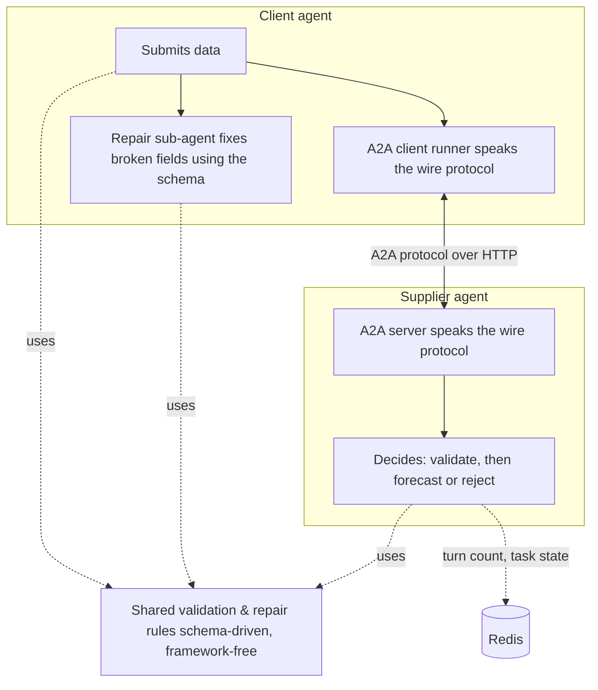

# Agent Data Contracts Demo

A demo of two A2A agents negotiating a data exchange automatically, with schema validation and automated data fixing on one side (no human in the loop)

## The scenario

A **client agent** wants sales-forecast predictions for a batch of records. A **supplier agent** ("forecasting service") will make those predictions, but only for data that matches its published contract — a JSON Schema describing exactly which fields are required, their types, and any constraints (e.g. "price must not be negative").

1. The client sends its data.
2. The supplier validates it against the contract. If everything checks out, it returns forecasts.
3. If not, it rejects the batch and returns a precise, field-by-field list of what's wrong.
4. The client attempts to repair the broken fields itself and resubmits.
5. This repeats until the data is clean, or the supplier decides the client isn't progressing with the updates quick enough and ends the negotiation, so a client stuck in a bad loop can't negotiate forever. This a form of circuit breaker pattern and helps to avoid infinite loops. In this demo, this number of turns is set to `5`.

The demo shows what "self-healing" integration between two independent, automated services can look like once both sides agree on a formal data contract and can reason about *why* an exchange failed, not just *that* it failed.

## The data contract

The contract is a plain JSON Schema file (`contracts/forecasting_contract.json`) — it defines the array of records the client submits: which fields each record must have, their types, and any constraints. Both agents read the same file, which is what lets the supplier's rejection reasons and the client's repairs stay in lockstep.

The one shipped with this demo describes a row of per-store, per-product sales data:

```json
{
  "$schema": "http://json-schema.org/draft-07/schema#",
  "title": "ForecastingDataContract",
  "description": "Data contract for the forecasting service.",
  "type": "array",
  "minItems": 2,
  "items": {
    "type": "object",
    "properties": {
      "timestamp": {
        "type": "string",
        "description": "ISO 8601 formatted date-time string"
      },
      "store_id": {
        "type": "integer",
        "minimum": 1,
        "description": "Positive integer identifier for the store"
      },
      "product_id": {
        "type": "integer",
        "minimum": 1,
        "description": "Positive integer identifier for the product"
      },
      "price": {
        "type": "number",
        "minimum": 0.01,
        "description": "Item price, must be positive"
      },
      "on_promotion": {
        "type": "boolean",
        "description": "Flag indicating if the product is on promotion"
      },
      "historical_sales": {
        "type": "number",
        "minimum": 0.0,
        "description": "Number of sales, must be non-negative"
      }
    },
    "required": [
      "timestamp",
      "store_id",
      "product_id",
      "price",
      "on_promotion",
      "historical_sales"
    ],
    "additionalProperties": false
  }
}
```

A record fails validation if a required field is missing, a value has the wrong type, a number falls below its `minimum`, or an undeclared field is present (`additionalProperties: false`). Because the repair logic reads these rules off the schema itself rather than hardcoding `store_id`/`price`/etc. by name, swapping in a different contract — different fields, different types, different constraints — needs no code changes on either side. `scripts/generate_test_data.py` relies on exactly this to generate entirely random contracts and still have the same demo work correctly (see "Generating new scenarios" below).

## Technical key points

- **Real agent framework, real protocol.** Both agents are built on Google's Agent Development Kit (ADK) and talk to each other over A2A (Agent2Agent), the open protocol for agent-to-agent communication — not a bespoke API.
- **The repair logic is schema-driven, not hardcoded.** The client doesn't know the contract's field names in advance. It reads the JSON Schema and works out how to fix a broken field from that field's own declared type and constraints. Swap in a completely different contract with different fields and the same code still repairs it correctly.
- **The turn budget lives with the supplier, not the client**, and survives a restart (it's backed by Redis) — realistic for a service that has to defend itself against a client that never ends the communication and becomes a blocker, rather than trusting the client to police itself.
- **Full observability.** Every negotiation is traced end to end with OpenTelemetry, so you can pull up one negotiation and see both agents' side of every turn.

## Architecture

Three concerns are kept deliberately separate throughout the codebase:



1. **Agent reasoning** (the ADK agents) decides *what to do* — submit, repair, or stop. It knows nothing about HTTP or the wire protocol.
2. **Communication** (the A2A layer) translates that decision to and from A2A protocol messages, and manages the negotiation's lifecycle (submitted → working → input needed → ... → done).
3. **Shared rules** (`agents/logic.py`) hold the actual validation and repair logic — framework-free, easy to test on its own, and the one place to change *what counts as broken* or *how it gets fixed*.

The client's repair step is itself a small ADK sub-agent, invoked by the client's main agent the same way ADK's built-in orchestration agents invoke their children. It reflects real world situation, when the agent needs to identify and solve the data quality issues, or it may involve human in the loop. That also keeps "decide whether to repair" and "how to repair" as two separate, independently testable pieces.

## Keeping the negotiation honest

- The supplier counts turns per negotiation in Redis and cuts things off after a configurable limit, regardless of what the client does.
- Task state and the message queue between the two agents are also stored in Redis rather than kept in memory, so the supplier can restart mid-negotiation without losing track of where things stand.
- A handful of concurrency bugs in the third-party Redis transport library the supplier depends on are patched at startup (`agents/a2a_redis_patches.py`) — without them, multi-turn negotiations hang or silently drop messages.


## Project layout

```
agents/                       core agent logic (see Architecture above)
contracts/                    the JSON Schema data contract
data/                         8 example scenarios (compatible data, missing fields, bad types, ...)
scripts/generate_test_data.py generates fresh randomized contracts + matching scenarios
tests/                        pytest suite

simulation.py                 run all scenarios in-process, no network (fastest; powers the tests)
simulation_a2a.py              run all scenarios over a real local A2A server + client process
simulation_a2a_services.py    run all scenarios against the Dockerized stack, over REST
supplier_service.py            run the supplier as a standalone A2A server
client_app.py                  run the client once, against a running supplier
client_service.py             run the client as a REST service (used inside Docker)

docker-compose.yml, Dockerfile.*, run.sh   containerized deployment
```

### Running the demo 

The easiest way: build and run a "runner" image on the same Docker network as the deployed stack, then tear the stack down when finished:

```
./run.sh
```

Fastest: in-process, no server:

```
python3 simulation.py
```

Real HTTP, locally (spins up a real supplier server and a real client process per scenario, talking actual A2A protocol messages over HTTP):

```
python3 simulation_a2a.py
```

### Tests

```
python3 -m pytest tests/ -q
```

### Generating new scenarios

```
python3 scripts/generate_test_data.py --seed 1 --verify
```

Produces a brand-new contract with randomly chosen field names and types, plus all 8 scenario files to match. `--verify` runs them all and checks the outcomes are still what's expected.

## Observability

Every negotiation is traced with OpenTelemetry. By default traces go to Langfuse; set `TRACING_BACKEND=jaeger` in `.env` to send them to a local Jaeger instance instead (`docker compose up` starts one — UI at `http://localhost:16686`).

## Setup

```
pip install -r requirements.txt
```